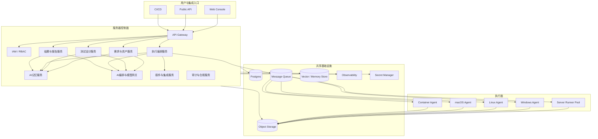

# AI自动化测试工具架构设计说明

## 背景

目标产品不是一个单点测试执行器，而是一个 AI-native 的测试工作台和执行平台。它既要覆盖需求分析、测试资产建设、执行、结果分析、报告沉淀，又要支持不同基础设施环境中的执行 agent，并允许后续继续扩展新的测试协议、AI 能力和企业集成。

用户提出了几个硬要求：

- 平台部署在服务器侧。
- agent 可以部署在 Windows、Linux、macOS 和容器里。
- 至少支持 Web 测试和 API 测试。
- 平台必须支持扩展。
- 流程要覆盖需求、测试用例、测试结果、测试报告。
- 整个平台要 AI native，且记忆能力要自然融入所有流程。
- Web 测试必须提供 step 级别控制。

这意味着架构不能只围绕“跑一次测试”设计，而要围绕“测试资产生命周期 + 智能协作 + 可扩展执行底座”设计。

## 设计目标

- 统一控制面：业务状态、AI 协作、租户边界、资产管理都由服务器控制面统一管理。
- 异构执行面：执行动作可以下沉到服务器 runner 或远程 agent，agent 运行环境不受操作系统限制。
- 测试全链路：需求、测试用例、执行、结果、报告、缺陷和知识沉淀构成一个闭环。
- AI 原生化：AI 不作为外挂功能，而是成为需求理解、用例生成、步骤建议、失败归因、报告摘要、知识召回的基础能力。
- 记忆内建：所有核心流程都可读写记忆，不依赖额外“记忆功能按钮”。
- 可扩展：协议、执行器、断言、报告、企业集成、模型服务都可独立扩展。
- 可控性：即使引入 AI，执行层仍然必须保持确定性、可审计和可回放。

## 总体架构

## 核心设计原则

### 1. 控制面与执行面严格分离

- 控制面负责业务状态、调度、AI 协作、租户隔离、配额、审计、报告。
- 执行面只负责执行任务、采集产物、回传结果。
- agent 不直接访问业务数据库，只通过受控协议与控制面交互。

### 2. AI 参与决策，执行保持可控

- AI 可以生成建议、补充上下文、做失败归因和摘要。
- 真正落到执行层的内容必须转成显式 DSL 或结构化任务，不允许以不透明 prompt 直接驱动执行器。
- 所有 AI 生成物都要记录来源、版本、输入上下文和人工确认状态。

### 3. 记忆是基础设施，不是附属页面

- 需求分析会写入记忆。
- 用例设计时会自动召回相似需求、历史故障和已有步骤模板。
- 执行失败时会把错误模式、定位线索和修复结论沉淀到记忆。
- 报告生成时会基于历史变更、执行记录和风险画像进行摘要。

### 4. Step 级控制优先于脚本自由度

- Web 测试的最小执行单元是 `step`，而不是整段自由代码。
- step 要有显式动作、目标、输入、预期、超时、重试、证据策略。
- 允许组合成流程，但单步必须可暂停、可重试、可回放、可插桩。

## 部署架构

### 服务器端

服务器端部署控制面服务和可选的 server runner：

- `Web Console`：面向测试人员、管理员和审阅者的 UI。
- `Gateway + IAM`：统一认证鉴权、租户边界、API 入口。
- `Req / Case / Run / Report / Memory / AI / Plugin`：核心业务服务。
- `Server Runner Pool`：用于直接在服务器环境内运行测试任务，适合公共环境或无私网依赖场景。

推荐部署模式：

- 开发环境：Docker Compose 单机部署。
- 生产环境：Kubernetes 或 VM 集群部署。
- Runner 池独立水平扩缩。
- 模型网关、对象存储、向量存储可按租户规模独立扩容。

### Agent 端

agent 是跨平台执行节点，统一遵循同一套注册、调度、执行和回传协议。

支持部署形态：

- Windows Agent：适合桌面应用相关环境、Windows 浏览器矩阵、企业内网环境。
- Linux Agent：适合 CI 节点、服务器侧浏览器执行、API 压测和批量执行。
- macOS Agent：适合 Safari、WebKit、苹果生态兼容性验证。
- Container Agent：适合短生命周期隔离执行、弹性调度、按镜像固化测试依赖。

agent 本地组件建议拆分为：

- `Agent Core`：注册、心跳、拉取任务、状态上报、配置管理。
- `Execution Sandbox`：隔离执行进程和依赖。
- `Web Worker`：浏览器和页面自动化执行。
- `API Worker`：HTTP / gRPC / WebSocket 等接口测试执行。
- `Artifact Uploader`：上传截图、trace、video、HAR、日志。
- `Local Tool Bridge`：可选的本地工具桥，用于访问内网系统、证书、桌面环境。

## 业务域模型

### 1. 需求域

核心实体：

- `requirement`：需求、故事、缺陷或变更条目。
- `acceptance_criteria`：验收标准。
- `risk_item`：风险点和覆盖重点。
- `trace_link`：需求与测试资产、执行结果、缺陷之间的追踪关系。

AI 作用：

- 解析自然语言需求，提取场景、规则、风险。
- 生成候选验收标准和覆盖建议。
- 自动关联历史相似需求和已知风险。

### 2. 测试设计域

核心实体：

- `test_case`：测试用例定义。
- `test_suite`：测试集。
- `step_template`：步骤模板库。
- `api_scenario`：接口测试场景。
- `web_flow`：Web 页面交互流程。
- `dataset` / `environment_profile`：数据集和环境配置。

AI 作用：

- 从需求生成候选用例和步骤。
- 从历史执行中推荐稳定 locator、断言模式和测试数据。
- 对新增需求做覆盖差距分析。

### 3. 执行域

核心实体：

- `run`：一次执行任务。
- `run_item`：run 内部的可执行单元。
- `job`：派发到 runner 或 agent 的原子执行任务。
- `attempt`：重试记录。
- `artifact`：截图、trace、日志、HAR、视频等。

执行维度：

- 按需求执行
- 按测试集执行
- 按分支 / 提交 / 构建执行
- 按环境、浏览器、数据集、agent 标签执行

### 4. 结果与报告域

核心实体：

- `result`：结构化执行结果。
- `finding`：失败原因、风险点、异常发现。
- `report_job`：报告生成任务。
- `report_template`：报告模板。
- `defect_link`：缺陷关联。

AI 作用：

- 聚合失败簇。
- 给出疑似根因和影响面。
- 生成不同受众版本的报告摘要。
- 将失败模式回写记忆，供后续需求和用例阶段复用。

## 从需求到报告的全链路

这个流程的关键点是“人工与 AI 协同”：

- 需求和用例阶段，AI 提高产出速度。
- 执行阶段，系统保持结构化、可控、可审计。
- 结果阶段，AI 帮助归因、摘要、横向对比。
- 沉淀阶段，记忆系统让下一轮工作更快、更稳。

## AI-native 设计

### AI 编排层

建议单独设置 `AI Orchestrator` 与 `Model Gateway`：

- 屏蔽底层模型差异，兼容不同 LLM / embedding / reranker。
- 统一 prompt 模板、工具调用、上下文注入、成本与延迟控制。
- 对敏感数据做脱敏和策略过滤。
- 输出统一结构化结果，而不是将大模型输出直接散落在业务服务里。

### AI 在各流程中的作用

- 需求阶段：需求拆解、风险提取、验收标准补全。
- 用例阶段：生成候选用例、推荐步骤模板、发现覆盖缺口。
- 执行前：自动补全环境差异、生成数据建议、估算执行成本。
- 执行中：做定位器修复建议、失败分类、动态上下文解释。
- 执行后：聚合同类问题、撰写报告摘要、生成缺陷描述。
- 治理层：识别低价值用例、长期不稳定 case、环境漂移。

## 记忆系统设计

记忆不能只做一个向量库，而要做多层记忆：

### 1. 语义记忆

- 以 requirement、case、failure、report 为对象写入向量索引。
- 用于相似需求召回、历史失败召回、步骤模板召回。

### 2. 结构化记忆

- 用关系型结构保存稳定事实，例如租户配置、环境拓扑、系统接口、页面对象、依赖系统。
- 用于提供高可靠上下文，不依赖模型猜测。

### 3. 事件记忆

- 保存执行历史、失败序列、重试轨迹、最近变更。
- 用于定位“最近为什么开始失败”“哪次变更后不稳定”。

### 4. 团队记忆

- 保存人工审阅结论、排障经验、常见误报、业务约束。
- 这些内容需要带来源和可信度，不能和模型生成内容混在一起。

### 记忆写入与读取时机

- 需求创建 / 更新时写入。
- 新用例保存时写入。
- 执行失败、人工标注根因、报告归档时写入。
- 在需求解析、用例设计、失败分析、报告生成时自动召回。

### 记忆边界

- 记忆必须按 `tenant_id` / `project_id` 隔离。
- 高风险上下文需要显式脱敏。
- 记忆结果必须带来源引用，便于人审阅。

## Web 测试的 Step 级控制设计

这是整个平台的关键差异化能力之一。Web 自动化不应只暴露“脚本代码编辑器”，而应提供结构化 step 图谱。

### Step 数据模型

建议一个 step 至少包含：

- `step_id`
- `type`：open / click / input / select / wait / assert / extract / upload / hover / custom
- `target`：页面、frame、locator、元素语义标识
- `input`：输入值、变量引用、密文引用
- `precondition`：执行前页面状态约束
- `expectation`：执行后断言
- `timeout_ms`
- `retry_policy`
- `artifact_policy`
- `on_failure`：截图、保留上下文、停止或继续

### Step 执行引擎

step 引擎应支持：

- 单步执行
- 断点续跑
- 单步重试
- step 回放
- step 级日志和产物归档
- step 级耗时和稳定性统计
- step 级 AI 辅助诊断

### Step 级 AI 能力

- 在录制或编辑步骤时推荐 locator 和断言。
- 在 step 失败时分析是页面变化、元素不存在、网络问题还是数据问题。
- 给出“建议修复”，但默认不自动修改已发布用例。
- 对动态页面可推荐更稳定的语义锚点，而不是只依赖 CSS/XPath。

### Step 级证据

每个 step 最好支持：

- 前后截图
- DOM snapshot
- console / network 片段
- trace 片段
- 失败时的上下文变量

这样报告里才能实现“失败定位到第几步、为什么失败、相关证据是什么”。

## API 测试设计

API 测试不应只支持静态请求，还要支持场景化编排。

建议能力：

- REST / GraphQL / gRPC / WebSocket 扩展点
- 请求模板、环境变量、密文变量、动态变量提取
- 前置依赖调用和链路编排
- schema 校验、状态码校验、字段断言、业务断言
- 场景级数据驱动
- 接口契约漂移检测
- 与需求和缺陷的双向追踪

AI 可以用于：

- 根据接口文档生成候选用例
- 根据失败响应生成疑似原因和改进建议
- 根据历史波动识别脆弱接口

## 扩展机制

平台扩展性建议基于插件和能力注册来做。

### 可扩展维度

- 执行器：Web、API、移动端、桌面端、消息协议
- 集成器：Jira、禅道、飞书、Slack、GitLab、Jenkins
- 报告器：PDF、HTML、JSON、JUnit、自定义模板
- AI 工具：不同模型、embedding 服务、reranker、知识源连接器
- 断言包：领域断言、接口断言、页面断言、数据断言

### 插件契约

每个插件应声明：

- 插件标识和版本
- 支持的能力类型
- 输入 / 输出 schema
- 所需权限
- 可运行环境
- 超时和资源限制

执行时由控制面做能力匹配，再把任务派到合适的 runner 或 agent。

## 安全与治理

- Agent 注册必须走双向信任流程，建议采用短期证书或一次性注册令牌。
- Secret 不下发明文，agent 执行时按 scope 获取临时凭证。
- 所有执行和 AI 调用都应有审计日志。
- AI 输出进入关键流程前，应支持人工确认策略和策略引擎。
- 多租户数据、证据和记忆必须严格隔离。

## 可观测性

平台至少需要以下观测维度：

- 业务维度：任务数、run 成功率、case 稳定性、需求覆盖率。
- 执行维度：agent 在线数、队列长度、平均执行耗时、step 失败率。
- AI 维度：调用次数、命中率、延迟、成本、人工采纳率。
- 记忆维度：召回命中率、来源分布、过期率、无效记忆比率。

## 建议的分阶段落地

### Phase 1

- 需求、用例、执行、结果、报告五个主域先跑通。
- 支持 Web / API 两类执行。
- 支持 server runner + Linux agent。
- AI 先聚焦需求解析、用例生成、报告摘要、失败归因。

### Phase 2

- 扩展到 Windows / macOS / Container agent。
- 引入 step 级调试器和定位器推荐。
- 引入向量记忆和团队记忆回写。
- 打通 Jira / CI / 通知系统。

### Phase 3

- 插件生态化。
- 更多协议支持。
- 复杂工作流自动化和智能修复建议。
- 基于长期记忆做测试资产治理与质量预测。

## 主要风险

- AI 生成内容质量不稳定，可能引入错误测试资产。
- 记忆污染会导致错误上下文被重复召回。
- Step 级控制如果设计得过于自由，会重新退化成脚本平台。
- 跨平台 agent 如果没有统一能力宣告，会导致调度不准确。
- 扩展机制如果没有权限和资源隔离，会引入安全风险。

## 验证计划

- 通过文档检查确认设计覆盖用户提出的全部核心需求。
- 运行仓库的文档与契约校验脚本。
- 将验证结果写入测试报告与举证文档。
