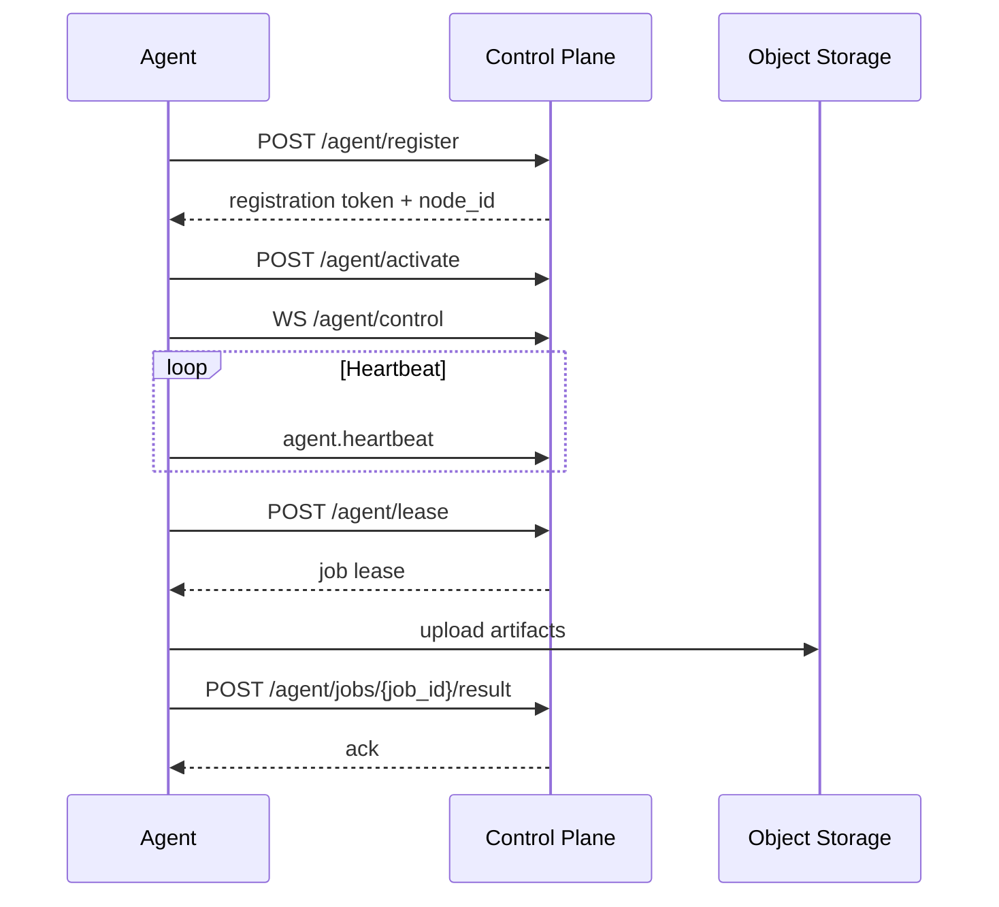
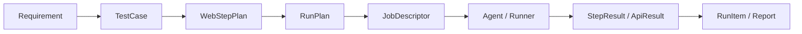

# Go控制面Agent协议Web step DSL接口和数据模型设计说明

## 背景

前两轮已经确定了两件事：

- 平台架构采用“控制面 + 执行面 + AI-native + 记忆内建”的模式。
- 核心技术栈采用 `Go + TypeScript + Python`，其中 Go 负责控制面和 Agent Core，Playwright + TypeScript 负责 Web 执行，Python 负责 AI 编排。

真正进入实现阶段前，还缺三块关键设计：

- Go 控制面对外和对内到底暴露哪些接口。
- Agent 与控制面如何建联、领任务、回传结果。
- Web step DSL 应该长什么样，才能既适合 UI 设计器，又适合 Playwright 执行器。

## 设计目标

- 为后续 OpenAPI / AsyncAPI 编写提供结构化蓝图。
- 控制面接口对用户和 agent 分层，不混用。
- Agent 协议既支持长连接控制，又支持幂等的结果回传。
- Web step DSL 既结构化，又能表达实际页面自动化场景。
- 数据模型保持与现有 `run` / `run_item` / `job` 状态机兼容。

## 设计边界

本设计覆盖：

- 控制面 REST 接口分组与关键请求 / 响应模型
- Agent 协议与消息模型
- Web step DSL 与执行结果模型

本设计不覆盖：

- 具体数据库表 DDL
- Playwright worker 内部代码实现
- AI 提示词工程细节
- 完整 OpenAPI / AsyncAPI YAML 落地

## 一、Go 控制面接口设计

### 1.1 接口分层

控制面接口建议分三类：

- `Console API`：给 Web Console 和外部系统使用的 REST API。
- `Agent API`：给 agent 使用的注册、心跳、租约、结果回传接口。
- `Internal API`：控制面内部服务之间的调用边界，可实现为 HTTP/gRPC，不直接暴露给外部。

### 1.2 Console API 分组

| 分组 | 示例 endpoint | 用途 |
| --- | --- | --- |
| Requirements | `POST /api/v1/requirements` | 录入需求、故事、缺陷、变更请求 |
| Test Cases | `POST /api/v1/test-cases` | 创建测试用例、步骤和参数 |
| Step Templates | `GET /api/v1/step-templates` | 查询步骤模板 |
| Run Plans | `POST /api/v1/run-plans:compile` | 从需求 / 用例编译执行计划 |
| Runs | `POST /api/v1/runs` | 创建执行任务 |
| Run Items | `GET /api/v1/run-items` | 查询执行单元与状态 |
| Reports | `POST /api/v1/report-jobs` | 生成报告 |
| Agents | `GET /api/v1/agent-nodes` | 查看 agent 节点与能力 |
| Memories | `POST /api/v1/memory/query` | 查询 AI 和记忆上下文 |

### 1.3 建议的关键 REST 接口

#### Requirements

- `POST /api/v1/requirements`
- `GET /api/v1/requirements`
- `GET /api/v1/requirements/{requirement_id}`
- `POST /api/v1/requirements/{requirement_id}:analyze`

#### Test Cases

- `POST /api/v1/test-cases`
- `GET /api/v1/test-cases/{test_case_id}`
- `POST /api/v1/test-cases/{test_case_id}:draft-from-requirement`
- `POST /api/v1/test-cases/{test_case_id}:validate`

#### Run Planning

- `POST /api/v1/run-plans:compile`
- `POST /api/v1/runs`
- `POST /api/v1/runs/{run_id}:cancel`

#### Agent Management

- `GET /api/v1/agent-nodes`
- `GET /api/v1/agent-nodes/{agent_node_id}`
- `POST /api/v1/agent-nodes/{agent_node_id}:disable`

### 1.4 控制面核心数据模型

#### Requirement

```yaml
Requirement:
  requirement_id: uuid
  tenant_id: uuid
  project_id: uuid
  source_type: enum(story, bug, task, api_change)
  title: string
  description: string
  acceptance_criteria: AcceptanceCriterion[]
  risk_items: RiskItem[]
  tags: string[]
  status: enum(draft, active, archived)
  created_by: uuid
  created_at: datetime
  updated_at: datetime
```

#### TestCase

```yaml
TestCase:
  test_case_id: uuid
  tenant_id: uuid
  project_id: uuid
  requirement_ids: uuid[]
  type: enum(web, api, hybrid)
  title: string
  objective: string
  preconditions: string[]
  variables: VariableDefinition[]
  steps: WebStep[] | ApiStep[]
  assertions: Assertion[]
  datasets: DatasetRef[]
  status: enum(draft, active, deprecated)
  version: integer
```

#### RunPlan

```yaml
RunPlan:
  run_plan_id: uuid
  source_type: enum(requirement, test_case, suite)
  source_ids: uuid[]
  execution_mode: enum(server_runner, remote_agent)
  target_capabilities: CapabilitySelector
  items: RunPlanItem[]
  env_profile_id: uuid
  dataset_id: uuid
  trigger: TriggerInfo
```

#### AgentNode

```yaml
AgentNode:
  agent_node_id: uuid
  tenant_id: uuid
  project_id: uuid
  node_name: string
  os_type: enum(windows, linux, macos, container)
  host_name: string
  version: string
  labels: map[string]string
  capabilities: AgentCapability[]
  status: enum(registering, idle, busy, offline, draining)
  last_seen_at: datetime
```

## 二、Agent 协议设计

### 2.1 交互原则

- 注册和凭证交换走 HTTPS。
- 实时控制信号走 WebSocket。
- 大体积产物上传走对象存储直传或预签名 URL。
- 任务结果回传必须幂等。
- 每条消息必须带 `tenant_id`、`project_id`、`trace_id` 和 `schema_version`。

### 2.2 Agent 生命周期



### 2.3 Agent API

| 接口 | 方向 | 说明 |
| --- | --- | --- |
| `POST /api/v1/agent/register` | agent -> control | 初次注册 |
| `POST /api/v1/agent/activate` | agent -> control | 注册确认与证书 / token 激活 |
| `POST /api/v1/agent/heartbeat` | agent -> control | 心跳和资源状态 |
| `POST /api/v1/agent/lease` | agent -> control | 拉取一个可执行租约 |
| `POST /api/v1/agent/jobs/{job_id}/result` | agent -> control | 上报 job 结果 |
| `POST /api/v1/agent/jobs/{job_id}/artifacts:complete` | agent -> control | 产物上传完成通知 |
| `WS /api/v1/agent/control` | 双向 | 控制命令与事件通道 |

### 2.4 Agent 协议核心模型

#### AgentRegisterRequest

```yaml
AgentRegisterRequest:
  agent_name: string
  os_type: enum(windows, linux, macos, container)
  host_name: string
  agent_version: string
  labels: map[string]string
  capabilities: AgentCapability[]
```

#### AgentCapability

```yaml
AgentCapability:
  kind: enum(web, api, browser, file_upload, private_network)
  name: string
  version: string
  metadata: object
```

#### AgentHeartbeat

```yaml
AgentHeartbeat:
  agent_node_id: uuid
  status: enum(idle, busy, draining)
  running_jobs: integer
  cpu_percent: number
  memory_percent: number
  available_slots: integer
  observed_at: datetime
```

#### AgentLeaseRequest

```yaml
AgentLeaseRequest:
  agent_node_id: uuid
  max_jobs: integer
  capability_filter: CapabilitySelector
  supported_job_types: string[]
```

#### AgentLeaseResponse

```yaml
AgentLeaseResponse:
  lease_id: uuid
  expires_at: datetime
  jobs: JobDescriptor[]
```

#### JobDescriptor

```yaml
JobDescriptor:
  job_id: uuid
  run_id: uuid
  run_item_id: uuid
  job_type: enum(web, api)
  step_plan: WebStepPlan | ApiScenarioPlan
  env_profile: EnvProfile
  secrets_ref: SecretRef[]
  artifact_policy: ArtifactPolicy
  cancel_token: string
```

#### JobResultReport

```yaml
JobResultReport:
  job_id: uuid
  run_id: uuid
  run_item_id: uuid
  status: enum(passed, failed, canceled)
  started_at: datetime
  finished_at: datetime
  step_results: StepResult[]
  api_results: ApiResult[]
  error_summary: ErrorSummary
  artifact_refs: ArtifactRef[]
```

### 2.5 WebSocket 控制消息

控制面到 agent：

- `job.cancel`
- `agent.config.updated`
- `agent.drain`

agent 到控制面：

- `agent.ack`
- `agent.warning`
- `agent.log_fragment`

统一 envelope：

```yaml
AgentControlEnvelope:
  message_id: uuid
  message_type: string
  agent_node_id: uuid
  tenant_id: uuid
  project_id: uuid
  trace_id: string
  occurred_at: datetime
  payload: object
```

## 三、Web Step DSL 设计

### 3.1 设计目标

- 适合可视化编辑。
- 适合转译到 Playwright。
- 支持 step 级执行、回放、重试、证据采集。
- 能表达页面交互、提取、断言、控制流。

### 3.2 顶层模型

```yaml
WebStepPlan:
  plan_id: uuid
  version: string
  case_id: uuid
  name: string
  variables: VariableDefinition[]
  setup_steps: WebStep[]
  steps: WebStep[]
  teardown_steps: WebStep[]
```

### 3.3 WebStep 核心结构

```yaml
WebStep:
  step_id: string
  kind: enum(action, assertion, extraction, control)
  action: enum(open, click, input, select, wait, hover, upload, press, assert, extract, if, foreach, group)
  name: string
  locator: Locator
  input: StepInput
  preconditions: Assertion[]
  expectations: Assertion[]
  timeout_ms: integer
  retry_policy: RetryPolicy
  artifact_policy: ArtifactPolicy
  continue_on_failure: boolean
  children: WebStep[]
```

### 3.4 Locator 模型

```yaml
Locator:
  strategy: enum(role, text, label, placeholder, test_id, css, xpath)
  value: string
  options:
    exact: boolean
    nth: integer
    frame: string
```

推荐顺序：

- 优先 `role` / `label` / `test_id`
- 其次 `text`
- 最后 `css` / `xpath`

### 3.5 StepInput 模型

```yaml
StepInput:
  literal: string | number | boolean | object
  variable_ref: string
  secret_ref: string
  file_ref: string
```

### 3.6 Assertion 模型

```yaml
Assertion:
  assertion_id: string
  type: enum(visible, hidden, text_equals, text_contains, value_equals, url_contains, attr_equals, response_status)
  target: string
  expected: any
  operator: enum(eq, ne, contains, gt, lt)
  timeout_ms: integer
```

### 3.7 RetryPolicy 与 ArtifactPolicy

```yaml
RetryPolicy:
  max_attempts: integer
  interval_ms: integer
  backoff: enum(fixed, linear, exponential)

ArtifactPolicy:
  screenshot: enum(none, on_failure, before_after, always)
  trace: enum(none, on_failure, always)
  video: enum(none, on_failure, always)
  dom_snapshot: boolean
  network_capture: boolean
```

### 3.8 StepResult 模型

```yaml
StepResult:
  step_id: string
  status: enum(passed, failed, skipped, canceled)
  started_at: datetime
  finished_at: datetime
  duration_ms: integer
  error_code: string
  error_message: string
  locator_used: Locator
  artifacts: ArtifactRef[]
```

### 3.9 DSL 示例

```yaml
steps:
  - step_id: open_login
    kind: action
    action: open
    name: 打开登录页
    input:
      literal: https://example.test/login
    timeout_ms: 10000
  - step_id: input_username
    kind: action
    action: input
    name: 输入用户名
    locator:
      strategy: label
      value: 用户名
    input:
      variable_ref: vars.username
  - step_id: click_submit
    kind: action
    action: click
    name: 点击登录
    locator:
      strategy: role
      value: button[name='登录']
    expectations:
      - assertion_id: dashboard_visible
        type: visible
        target: page.dashboard
        expected: true
        timeout_ms: 5000
```

## 四、控制面、Agent、DSL 的衔接

### 4.1 编译链路



### 4.2 衔接规则

- `TestCase.steps` 保存 DSL 源定义。
- `RunPlan.items` 保存针对环境、数据集、浏览器扩展后的可执行计划。
- `JobDescriptor.step_plan` 是派发给 Web Worker 的执行单元。
- `JobResultReport.step_results` 回写到 `run_item` 和报告域。

## 五、与现有契约的映射关系

### 与 OpenAPI 的关系

- 现有 `/api/v1/runs`、`/api/v1/run-items`、`/api/v1/report-jobs` 可以保留。
- 后续新增的 `requirements`、`test-cases`、`run-plans`、`agent-nodes` 可作为新的 REST 资源组。

### 与 AsyncAPI 的关系

- 现有 `job.execute_requested` 可直接承载 `JobDescriptor`。
- 现有 `job.result_reported` 可扩展承载 `StepResult[]` 和 `ApiResult[]`。
- 未来可新增：
  - `agent.registered`
  - `agent.heartbeat_reported`
  - `agent.status_changed`

## 六、实现建议

- 先把本设计文档中的关键模型落成 OpenAPI / AsyncAPI schema。
- Go 控制面优先实现 `requirements`、`test-cases`、`run-plans:compile`、`agent/register`、`agent/lease`、`agent/jobs/{job_id}/result`。
- Web Worker 先支持 `open / click / input / wait / assert / extract` 这 6 类 step。
- 复杂控制流如 `foreach`、`group`、`if` 可以先在 DSL 中保留，但分阶段实现。

## 主要风险

- 如果控制面接口和 Agent 协议一起改，但没有 schema 驱动，后续实现会快速漂移。
- 如果 DSL 字段设计过松，Console 和执行器会各自扩展，最终失去兼容性。
- 如果 `job.result_reported` 不提前设计 step 结果结构，报告域很快会丢失精度。

## 验证计划

- 检查设计文档是否显式给出接口分组、Agent 协议消息和 DSL schema。
- 运行仓库文档与契约校验脚本。
- 将结果记录到测试报告和证据记录。
