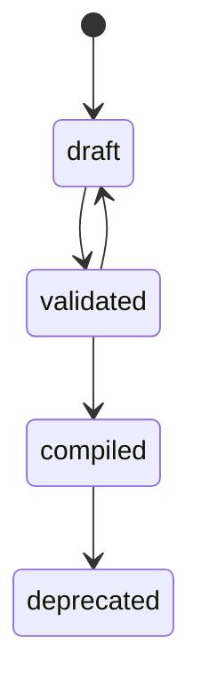
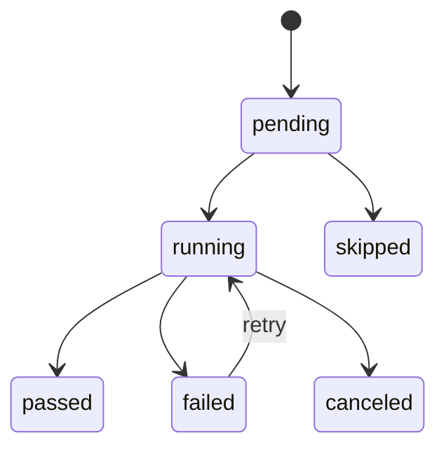
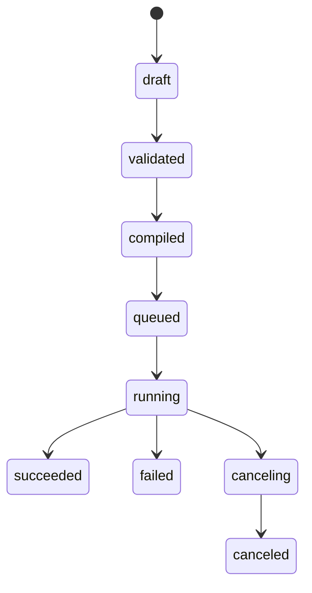

# Web step DSL字段约束状态机示例集合设计说明

## 背景

上一轮已经定义了 Web step DSL 的核心模型，包括 `WebStepPlan`、`WebStep`、`Locator`、`Assertion` 和 `StepResult`。但如果想把 DSL 真正落到 Console 设计器、编译器和 Playwright 执行器里，仅有字段名还不够，还需要解决三个问题：

- 哪些字段必填，哪些字段互斥，哪些字段有默认值。
- step 和 plan 在定义、编译、执行、结果归档过程中如何流转状态。
- 常见业务场景要如何用 DSL 表达，避免每个团队都写出完全不同风格。

## 设计目标

- 提供 schema 级字段约束，支撑前后端一致校验。
- 提供状态机，支撑 step 级调试、重试和报告映射。
- 提供示例集合，作为模板库和测试资产初始化样本。

## 一、字段约束

### 1.1 WebStepPlan 约束

```yaml
WebStepPlan:
  plan_id: uuid                # required
  version: string              # required, semver-like
  case_id: uuid                # required
  name: string                 # required, 1..120
  description: string          # optional, <= 2000
  variables: VariableDefinition[]  # optional, default []
  setup_steps: WebStep[]       # optional, default []
  steps: WebStep[]             # required, minItems=1
  teardown_steps: WebStep[]    # optional, default []
  tags: string[]               # optional
  default_timeout_ms: integer  # optional, default 10000, 100..120000
```

规则：

- `steps` 不能为空。
- `setup_steps` 和 `teardown_steps` 不建议承载复杂嵌套控制流。
- `version` 建议采用 `1.0.0` 风格，便于 DSL 兼容升级。

### 1.2 WebStep 通用约束

```yaml
WebStep:
  step_id: string              # required, regex ^[a-zA-Z][a-zA-Z0-9_\\-]{2,63}$
  kind: enum(action, assertion, extraction, control)
  action: enum(open, click, input, select, wait, hover, upload, press, assert, extract, if, foreach, group)
  name: string                 # required, 1..120
  locator: Locator             # conditional
  input: StepInput             # conditional
  preconditions: Assertion[]   # optional, maxItems=10
  expectations: Assertion[]    # optional, maxItems=20
  timeout_ms: integer          # optional, 100..120000
  retry_policy: RetryPolicy    # optional
  artifact_policy: ArtifactPolicy # optional
  continue_on_failure: boolean # optional, default false
  children: WebStep[]          # conditional
```

通用规则：

- `step_id` 在单个 plan 内唯一。
- `name` 用于展示，`step_id` 用于机器引用。
- step 未显式设置 `timeout_ms` 或 `artifact_policy` 时，继承 plan 默认值。

### 1.3 kind / action 组合约束

| kind | 允许 action | 必填字段 | 禁用字段 |
| --- | --- | --- | --- |
| `action` | `open`, `click`, `input`, `select`, `wait`, `hover`, `upload`, `press` | 视 action 而定 | `children` |
| `assertion` | `assert` | `expectations` | `children` |
| `extraction` | `extract` | `locator`, `input.variable_ref` | `children` |
| `control` | `if`, `foreach`, `group` | `children` | `group` 不要求 `locator` |

### 1.4 action 级约束

#### `open`

- 必填：`input.literal` 或 `input.variable_ref`
- 禁止：`locator`

#### `click`

- 必填：`locator`
- 可选：`expectations`

#### `input`

- 必填：`locator`
- 必填：`input.literal` / `input.variable_ref` / `input.secret_ref` 三选一
- 互斥：三者不能同时存在

#### `select`

- 必填：`locator`
- 必填：`input.literal` 或 `input.variable_ref`

#### `wait`

- 必填：以下至少一个：
  - `locator`
  - `expectations`
  - `input.literal`

#### `upload`

- 必填：`locator`
- 必填：`input.file_ref`

#### `press`

- 必填：`locator`
- 必填：`input.literal`
- 约束：`input.literal` 必须为键盘按键名称

#### `assert`

- 必填：`expectations`
- 禁止：`input`

#### `extract`

- 必填：`locator`
- 必填：`input.variable_ref`

#### `if`

- 必填：`preconditions` 或 `expectations`
- 必填：`children`

#### `foreach`

- 必填：`input.variable_ref`
- 必填：`children`
- 约束：`input.variable_ref` 应引用数组变量

#### `group`

- 必填：`children`

### 1.5 Locator 约束

```yaml
Locator:
  strategy: enum(role, text, label, placeholder, test_id, css, xpath)
  value: string
  options:
    exact: boolean
    nth: integer
    frame: string
```

规则：

- `value` 必填，长度建议 `1..300`
- `nth` 最小值为 `0`
- 推荐优先级：`role` / `label` / `test_id` > `text` > `css` / `xpath`

### 1.6 StepInput 约束

```yaml
StepInput:
  literal: any
  variable_ref: string
  secret_ref: string
  file_ref: string
```

规则：

- `literal`、`variable_ref`、`secret_ref`、`file_ref` 中最多一个作为主输入来源。
- `file_ref` 只允许在 `upload` 中使用。
- `secret_ref` 不允许在报告和日志中明文回显。

### 1.7 Assertion 约束

```yaml
Assertion:
  assertion_id: string
  type: enum(visible, hidden, text_equals, text_contains, value_equals, url_contains, attr_equals, response_status)
  target: string
  expected: any
  operator: enum(eq, ne, contains, gt, lt)
  timeout_ms: integer
```

规则：

- `assertion_id` 在单个 step 内唯一。
- `visible` / `hidden` 的 `expected` 只能是布尔值。
- `text_equals` / `text_contains` 的 `expected` 应为字符串。

### 1.8 StepResult 约束

```yaml
StepResult:
  step_id: string
  status: enum(passed, failed, skipped, canceled)
  started_at: datetime
  finished_at: datetime
  duration_ms: integer
  error_code: string
  error_message: string
  locator_used: Locator
  artifacts: ArtifactRef[]
```

规则：

- `status=passed` 时，`error_code` 和 `error_message` 应为空。
- `status=failed` 时，`error_code` 必填。
- `duration_ms` 应等于 `finished_at - started_at`。

## 二、状态机

### 2.1 Step 定义态状态机



### 2.2 Step 执行态状态机



说明：

- `pending`：已进入计划，尚未执行。
- `running`：执行器正在执行当前 step。
- `passed`：动作和断言都通过。
- `failed`：动作失败或断言失败。
- `skipped`：控制流未进入或前置失败导致未执行。
- `canceled`：run 取消或人工停止。

### 2.3 Plan 执行态状态机



### 2.4 控制流状态影响

- `if`：条件不满足时，子 step 结果记为 `skipped`
- `foreach`：每次迭代都应产生子 step result
- `group`：可生成聚合结果，但不能替代子 step 明细

## 三、错误码建议

| 错误码 | 含义 | 常见原因 |
| --- | --- | --- |
| `STEP_LOCATOR_NOT_FOUND` | 元素未找到 | 页面变化、locator 不稳定、等待不足 |
| `STEP_ASSERTION_FAILED` | 断言失败 | 页面状态与预期不一致 |
| `STEP_TIMEOUT` | 执行超时 | 页面慢、条件错误 |
| `STEP_INPUT_INVALID` | 输入无效 | 变量缺失、字段互斥违规 |
| `STEP_UPLOAD_FILE_MISSING` | 上传文件缺失 | 文件路径无效 |
| `STEP_CONTROL_CONDITION_ERROR` | 控制流条件错误 | `if` / `foreach` 条件配置错误 |
| `STEP_BROWSER_ERROR` | 浏览器执行异常 | 页面崩溃、上下文失效 |

## 四、示例集合

### 4.1 登录示例

```yaml
name: 登录流程
steps:
  - step_id: open_login
    kind: action
    action: open
    name: 打开登录页
    input:
      literal: https://example.test/login
  - step_id: input_username
    kind: action
    action: input
    name: 输入用户名
    locator:
      strategy: label
      value: 用户名
    input:
      variable_ref: vars.username
  - step_id: input_password
    kind: action
    action: input
    name: 输入密码
    locator:
      strategy: label
      value: 密码
    input:
      secret_ref: secrets.password
  - step_id: click_login
    kind: action
    action: click
    name: 点击登录
    locator:
      strategy: role
      value: button[name='登录']
  - step_id: assert_dashboard
    kind: assertion
    action: assert
    name: 断言进入首页
    expectations:
      - assertion_id: dashboard_visible
        type: visible
        target: dashboard
        expected: true
        timeout_ms: 5000
```

### 4.2 表单填写示例

```yaml
name: 创建用户表单
steps:
  - step_id: open_form
    kind: action
    action: open
    name: 打开创建用户页
    input:
      literal: https://example.test/users/new
  - step_id: fill_name
    kind: action
    action: input
    name: 填写姓名
    locator:
      strategy: placeholder
      value: 请输入姓名
    input:
      variable_ref: vars.name
  - step_id: select_role
    kind: action
    action: select
    name: 选择角色
    locator:
      strategy: label
      value: 角色
    input:
      literal: admin
```

### 4.3 文件上传示例

```yaml
name: 上传头像
steps:
  - step_id: upload_avatar
    kind: action
    action: upload
    name: 上传头像文件
    locator:
      strategy: test_id
      value: avatar-upload
    input:
      file_ref: files.avatar_png
```

### 4.4 条件分支示例

```yaml
name: 首次登录处理
steps:
  - step_id: check_tour_modal
    kind: control
    action: if
    name: 检查新手引导弹窗
    expectations:
      - assertion_id: tour_visible
        type: visible
        target: tour_modal
        expected: true
        timeout_ms: 1000
    children:
      - step_id: close_tour
        kind: action
        action: click
        name: 关闭引导
        locator:
          strategy: role
          value: button[name='关闭']
```

### 4.5 数据提取示例

```yaml
name: 提取订单号
steps:
  - step_id: extract_order_no
    kind: extraction
    action: extract
    name: 提取订单号
    locator:
      strategy: test_id
      value: order-no
    input:
      variable_ref: vars.order_no
```

### 4.6 分组示例

```yaml
name: 结算流程
steps:
  - step_id: checkout_group
    kind: control
    action: group
    name: 结算流程分组
    children:
      - step_id: fill_address
        kind: action
        action: input
        name: 填写地址
        locator:
          strategy: label
          value: 收货地址
        input:
          variable_ref: vars.address
      - step_id: click_pay
        kind: action
        action: click
        name: 点击支付
        locator:
          strategy: role
          value: button[name='支付']
```

## 五、实现建议

- 把字段约束落成 JSON Schema 或 OpenAPI component schema。
- Console 端与编译器共用同一套 schema 校验和 lint 规则。
- 执行器只消费 `compiled` 状态的 plan，不消费 `draft`。

## 主要风险

- schema 规则和 UI 规则分开维护会导致漂移。
- 状态机如果不映射到结果模型，报告层难以精确展示 step 行为。
- 示例集合如果不持续演化，会很快失去模板价值。

## 验证计划

- 检查设计文档是否显式给出字段约束、状态机和示例集合。
- 运行仓库文档与契约校验脚本。
- 将结果记录到测试报告和证据记录。
