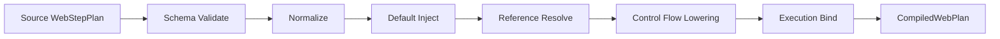

# Web step DSL编译规则Playwright执行映射表设计说明

## 背景

字段约束、状态机和示例集合已经定义了“DSL 长什么样”。但真正到执行时，中间还缺一层关键逻辑：

- Console 编辑出来的是“源 DSL”，不是最终执行计划。
- Worker 消费的应该是“编译后的 DSL”，而不是原始草稿。
- Playwright 执行器必须对每种 action 有明确的映射规则、输入约束和证据采集约定。

如果这层没有先设计清楚，后续很容易出现三个实现漂移：

- Console 设计器和编译器理解的字段语义不一致。
- 编译器和 Playwright worker 对控制流、默认值、变量的处理不一致。
- 报告层无法精确还原 step 到底执行了什么 Playwright 操作。

## 设计目标

- 把源 DSL 编译为稳定、可执行、可审计的执行计划。
- 让 Playwright worker 只消费编译产物，不承担 DSL 语义解释。
- 让执行结果能回填到 `StepResult` 和报告域。

## 一、编译阶段设计

### 1.1 输入、输出与阶段

输入：

- `WebStepPlanDraft`
- 环境配置 `EnvProfile`
- 数据集 `Dataset`
- 变量上下文 `VariableContext`

输出：

- `CompiledWebPlan`
- `CompiledStep[]`
- `CompileIssue[]`

建议编译管线：



### 1.2 阶段定义

#### 阶段 1：Schema Validate

目标：

- 校验必填字段
- 校验互斥字段
- 校验 `kind / action` 组合是否合法
- 校验变量引用和 step_id 唯一性

失败产物：

```yaml
CompileIssue:
  code: string
  severity: enum(error, warning)
  step_id: string
  field_path: string
  message: string
```

#### 阶段 2：Normalize

目标：

- 统一枚举大小写
- 清理空数组、空对象、无效空白字符串
- 规范 locator 结构
- 规范 `input` 主输入来源

规则：

- 所有 step 都显式带上 `kind` 和 `action`
- 所有 locator 都标准化为 `{strategy, value, options}`
- `input` 统一转换成 `input_source + input_value`

#### 阶段 3：Default Inject

目标：

- 注入 plan 级默认超时
- 注入 plan 级证据策略
- 为未配置 retry 的 step 注入默认 retry policy

建议默认值：

```yaml
default_timeout_ms: 10000
default_retry_policy:
  max_attempts: 1
  interval_ms: 0
  backoff: fixed
default_artifact_policy:
  screenshot: on_failure
  trace: on_failure
  video: none
  dom_snapshot: false
  network_capture: false
```

#### 阶段 4：Reference Resolve

目标：

- 展开 `variable_ref`
- 绑定 `secret_ref`
- 校验 `file_ref`
- 将环境变量和数据集绑定到 step 输入

规则：

- `secret_ref` 在编译产物中只保留引用，不注入明文。
- `file_ref` 在编译时检查逻辑存在性，在执行前做 agent 侧物理存在性检查。
- `variable_ref` 如果指向运行时变量，应保留 runtime placeholder。

#### 阶段 5：Control Flow Lowering

目标：

- 将 `if`、`foreach`、`group` 编译成带有显式边界的执行树。

建议：

- 不在编译时完全展开 `foreach` 动态数组，而是保留运行时展开指令。
- `group` 编译成逻辑容器节点，不直接映射 Playwright API。
- `if` 编译成“先执行条件断言，再决定是否进入 children”。

#### 阶段 6：Execution Bind

目标：

- 绑定浏览器类型、上下文配置、storage state、network capture 配置
- 生成 worker 可直接执行的 `CompiledStep`

## 二、编译输入 / 输出模型

### 2.1 Source WebStepPlan

源 DSL 模型沿用上一轮定义，作为编译输入。

### 2.2 CompiledWebPlan

```yaml
CompiledWebPlan:
  compiled_plan_id: uuid
  source_plan_id: uuid
  source_version: string
  browser_profile:
    browser: enum(chromium, firefox, webkit)
    headless: boolean
    viewport:
      width: integer
      height: integer
    storage_state_ref: string
  runtime_variables: object
  compiled_steps: CompiledStep[]
```

### 2.3 CompiledStep

```yaml
CompiledStep:
  compiled_step_id: string
  source_step_id: string
  action: string
  name: string
  execute_mode: enum(single, branch, loop, group)
  locator_resolved: ResolvedLocator
  input_resolved: ResolvedInput
  expectations: CompiledAssertion[]
  timeout_ms: integer
  retry_policy: RetryPolicy
  artifact_policy: ArtifactPolicy
  runtime_hooks: RuntimeHook[]
  children: CompiledStep[]
```

### 2.4 ResolvedLocator

```yaml
ResolvedLocator:
  strategy: enum(role, text, label, placeholder, test_id, css, xpath)
  value: string
  frame_path: string[]
  nth: integer
  stability_rank: enum(preferred, acceptable, fragile)
```

## 三、编译规则

### 3.1 变量解析规则

变量来源优先级建议：

1. step 显式输入
2. 运行时注入变量
3. 数据集变量
4. 环境变量
5. plan 默认变量

规则：

- 同名变量冲突时，低优先级变量被覆盖。
- 被覆盖行为需记录 `warning` 级 `CompileIssue`。

### 3.2 控制流编译规则

#### `if`

编译结构：

```yaml
CompiledStep:
  execute_mode: branch
  branch_condition: CompiledAssertion[]
  children: CompiledStep[]
```

执行语义：

- 先执行 `branch_condition`
- 成功则执行 children
- 否则 children 全部标记 `skipped`

#### `foreach`

编译结构：

```yaml
CompiledStep:
  execute_mode: loop
  loop_source: variable_ref
  iteration_alias: string
  children: CompiledStep[]
```

执行语义：

- worker 在运行时读取 `loop_source`
- 每个元素生成一组逻辑 child execution
- 每次迭代附加 iteration index

#### `group`

编译结构：

```yaml
CompiledStep:
  execute_mode: group
  children: CompiledStep[]
```

执行语义：

- 不直接调用 Playwright API
- 只用于组织结果和日志边界

### 3.3 证据策略编译规则

编译后每个 step 必须明确：

- 是否在执行前截图
- 是否在失败时截图
- 是否开启 trace
- 是否开启 network capture

建议转为 worker 可执行布尔开关：

```yaml
RuntimeHook:
  name: string
  enabled: boolean
  params: object
```

## 四、Playwright 执行映射表

### 4.1 总体原则

- DSL action 不直接暴露 Playwright 原始细节给用户。
- worker 根据 `CompiledStep` 做 Playwright 调用。
- 所有映射都必须能回填到 `StepResult`。

### 4.2 映射矩阵

| DSL action | Playwright 主要调用 | 前置处理 | 结果记录 |
| --- | --- | --- | --- |
| `open` | `page.goto()` | URL 解析、超时设置 | URL、响应状态、耗时 |
| `click` | `locator.click()` | locator 解析、可见性等待 | 点击目标、失败原因 |
| `input` | `locator.fill()` | 输入值解析、敏感值脱敏 | 输入目标、是否成功 |
| `select` | `locator.selectOption()` | 选项值标准化 | 选中值 |
| `wait` | `locator.waitFor()` / `expect().to...` / `page.waitForTimeout()` | 判断 wait 类型 | 等待条件、耗时 |
| `hover` | `locator.hover()` | locator 解析 | hover 成功与否 |
| `upload` | `locator.setInputFiles()` | 文件存在性检查 | 文件名、上传结果 |
| `press` | `locator.press()` | key 名称校验 | key 值 |
| `assert` | `expect(locator/page)` | 断言类型分派 | 断言结果 |
| `extract` | `locator.textContent()` 等 | 提取器分派 | 提取值、目标变量 |
| `if` | 无直接 API | 先执行条件断言 | 分支命中情况 |
| `foreach` | 无直接 API | 运行时展开 | 迭代次数 |
| `group` | 无直接 API | 创建结果分组 | 分组聚合结果 |

### 4.3 Locator 解析映射

| Locator strategy | Playwright 映射 |
| --- | --- |
| `role` | `page.getByRole(...)` |
| `text` | `page.getByText(...)` |
| `label` | `page.getByLabel(...)` |
| `placeholder` | `page.getByPlaceholder(...)` |
| `test_id` | `page.getByTestId(...)` |
| `css` | `page.locator(css)` |
| `xpath` | `page.locator(xpath)` |

规则：

- 有 `frame_path` 时先进入 frame，再构造 locator。
- 有 `nth` 时在最终 locator 上追加 `.nth(nth)`。

### 4.4 Assertion 映射

| Assertion type | Playwright 映射 |
| --- | --- |
| `visible` | `expect(locator).toBeVisible()` |
| `hidden` | `expect(locator).toBeHidden()` |
| `text_equals` | `expect(locator).toHaveText()` |
| `text_contains` | `expect(locator).toContainText()` |
| `value_equals` | `expect(locator).toHaveValue()` |
| `url_contains` | `expect(page).toHaveURL()` |
| `attr_equals` | `expect(locator).toHaveAttribute()` |

### 4.5 Extraction 映射

| 提取场景 | Playwright 调用 |
| --- | --- |
| 提取文本 | `locator.textContent()` |
| 提取值 | `locator.inputValue()` |
| 提取属性 | `locator.getAttribute(name)` |
| 提取 URL | `page.url()` |

## 五、执行结果回填规则

### 5.1 StepResult 生成规则

每个 `CompiledStep` 执行后必须生成一个 `StepResult`：

```yaml
StepResult:
  step_id: string
  compiled_step_id: string
  status: enum(passed, failed, skipped, canceled)
  started_at: datetime
  finished_at: datetime
  duration_ms: integer
  error_code: string
  error_message: string
  locator_used: ResolvedLocator
  runtime_call: string
  artifacts: ArtifactRef[]
```

### 5.2 Group / Branch / Loop 结果

- `group`：可生成聚合结果，但子 step result 必须保留。
- `if`：未命中分支的 children 标记 `skipped`。
- `foreach`：每次迭代生成带 `iteration_index` 的子结果。

## 六、错误处理建议

编译阶段错误：

- `COMPILE_SCHEMA_INVALID`
- `COMPILE_VARIABLE_UNRESOLVED`
- `COMPILE_CONTROL_FLOW_INVALID`
- `COMPILE_LOCATOR_INVALID`

执行阶段错误：

- `PLAYWRIGHT_NAVIGATION_FAILED`
- `PLAYWRIGHT_LOCATOR_TIMEOUT`
- `PLAYWRIGHT_ASSERTION_FAILED`
- `PLAYWRIGHT_UPLOAD_FAILED`

## 七、实现建议

- 先实现一个独立 `dsl-compiler` 模块，不把编译逻辑散在 Console 和 worker 两侧。
- 先支持 `open / click / input / wait / assert / extract / upload / press` 的映射。
- `if / foreach / group` 的执行树先在结果层可见，再逐步扩展 UI 展示能力。

## 主要风险

- 编译器如果在运行前做过多动态求值，会让 plan 可重放性变差。
- Playwright 映射如果混入过多特殊分支，会让 DSL action 语义失控。
- 结果回填如果不记录 `compiled_step_id`，后续很难追踪编译产物和源 step 的差异。

## 验证计划

- 检查设计文档是否显式给出编译规则和 Playwright 映射表。
- 运行仓库文档与契约校验脚本。
- 将结果记录到测试报告和证据记录。
