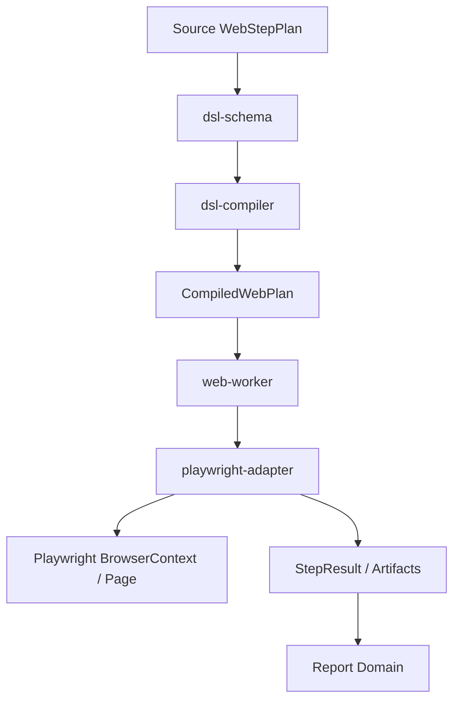
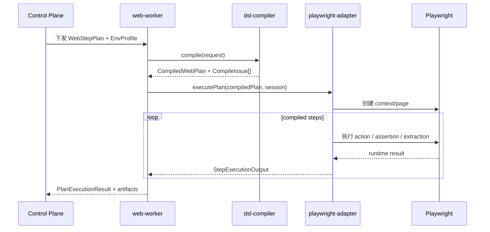

# DSL 编译器模块设计与 Playwright 适配层包结构设计说明

## 背景

上一轮已经把 Web step DSL 明确到了字段约束、状态机、编译规则和 Playwright 映射表。但实现仍缺两个关键拼图：

- 编译器到底如何拆模块，避免把校验、归一化、控制流降级、运行绑定和错误处理揉成一个大文件。
- Playwright 执行层如何形成稳定适配层，而不是在 Worker 里散落大量 `switch(action)` 和页面操作逻辑。

如果这两层没有先约束清楚，后续实现容易出现三个问题：

- Console、编译器和 Worker 对 DSL 语义解释不一致。
- Playwright 细节泄漏到编译器和报告域，导致边界不清。
- Web 自动化能力难以扩展到更多 step、hook、artifact 和插件执行器。

## 设计目标

- 将 Web step DSL 的编译与执行职责清晰拆分为独立模块。
- 让 `dsl-compiler` 产出稳定的中间表示，Worker 不再解释源 DSL。
- 让 `playwright-adapter` 只关心执行、采集和结果回填，不承担上游语义推导。
- 为后续 JSON Schema、代码实现、单元测试和集成测试提供直接蓝图。

## 一、总体分层

### 1.1 模块边界

建议按以下四层落地：

1. `dsl-schema`
   - 保存源 DSL、编译 DSL、StepResult、错误码等共享 schema 与 TypeScript type。
   - 提供序列化、反序列化、版本兼容工具。
2. `dsl-compiler`
   - 负责源 DSL 到编译 DSL 的完整转换。
   - 负责静态校验、归一化、默认值注入、控制流降级、执行绑定。
3. `playwright-adapter`
   - 负责把编译后 step 执行为 Playwright 操作。
   - 负责 locator 解析、动作执行、断言执行、数据提取、artifact 采集。
4. `web-worker`
   - 负责接收任务、拉起浏览器上下文、调用编译器和适配层、回传结果。
   - 不持有 DSL 业务规则，只做编排和生命周期管理。

### 1.2 调用关系



### 1.3 技术落地建议

建议把这三层实现为同一 monorepo 下的 TypeScript 包，而不是把编译器放进 Go 控制面：

- Web step DSL 与 Playwright 运行时天然在 TypeScript 生态中，类型复用成本最低。
- 编译器需要直接理解 locator、assertion、artifact、runtime hook 等 Web 运行概念，放在 Go 中会增加重复建模成本。
- Go 控制面只需要消费编译结果元数据和执行摘要，接口边界更稳定。

## 二、仓库级包结构

### 2.1 推荐目录

```text
packages/
  web-dsl-schema/
    src/source/
    src/compiled/
    src/result/
    src/errors/
    src/versioning/
  dsl-compiler/
    src/compiler.ts
    src/types.ts
    src/phases/
    src/resolvers/
    src/lowering/
    src/binders/
    src/diagnostics/
    src/emitters/
    src/testing/
  playwright-adapter/
    src/runtime/
    src/locators/
    src/actions/
    src/assertions/
    src/extractors/
    src/artifacts/
    src/hooks/
    src/result/
    src/testing/
apps/
  web-worker/
    src/job-runner/
    src/session/
    src/reporting/
    src/bootstrap/
```

### 2.2 包职责约束

- `web-dsl-schema`
  - 只能定义模型、枚举、schema、错误码、版本迁移工具。
  - 不允许直接依赖 Playwright。
- `dsl-compiler`
  - 可以依赖 `web-dsl-schema`。
  - 不允许直接依赖 Playwright。
  - 不允许执行 I/O 密集型浏览器操作。
- `playwright-adapter`
  - 可以依赖 `web-dsl-schema`。
  - 只消费 `CompiledWebPlan` / `CompiledStep`。
  - 不接受原始 `WebStepPlanDraft`。
- `web-worker`
  - 负责任务生命周期、浏览器会话、结果上报。
  - 不重复实现编译规则和 Playwright 动作语义。

## 三、dsl-compiler 模块设计

### 3.1 核心入口

建议对外只暴露两个稳定入口：

```ts
export interface CompileRequest {
  sourcePlan: WebStepPlanDraft;
  envProfile: EnvProfile;
  dataset?: DatasetRecord[];
  variableContext?: Record<string, unknown>;
  compileOptions?: CompileOptions;
}

export interface CompileResponse {
  compiledPlan?: CompiledWebPlan;
  issues: CompileIssue[];
  stats: CompileStats;
}

export interface DslCompiler {
  compile(request: CompileRequest): Promise<CompileResponse>;
  validate(request: CompileRequest): Promise<CompileIssue[]>;
}
```

约束：

- `compile()` 允许返回 `warning`，但出现 `error` 时不得返回可执行计划。
- `validate()` 只做静态校验，不做控制流降级和执行绑定。

### 3.2 phases 分层

`src/phases/` 建议拆成以下模块：

- `schema-validate.ts`
  - 检查必填字段、枚举、互斥项、唯一性、引用合法性。
- `normalize.ts`
  - 统一枚举、清理空值、标准化 locator 和 input 结构。
- `inject-defaults.ts`
  - 注入 plan/step 默认 timeout、retry、artifact policy。
- `resolve-references.ts`
  - 解析 `variable_ref`、`secret_ref`、`file_ref`、环境变量、数据集变量。
- `lower-control-flow.ts`
  - 将 `if`、`foreach`、`group` 转为显式执行树。
- `bind-execution.ts`
  - 绑定浏览器 profile、context profile、storage state、network capture 等执行期配置。
- `finalize.ts`
  - 生成 `CompiledWebPlan`、统计信息和 compile digest。

编排器：

```ts
export class DefaultDslCompiler implements DslCompiler {
  async compile(request: CompileRequest): Promise<CompileResponse> {
    const context = createCompileContext(request);
    schemaValidate(context);
    normalize(context);
    injectDefaults(context);
    resolveReferences(context);
    lowerControlFlow(context);
    bindExecution(context);
    finalize(context);
    return buildCompileResponse(context);
  }
}
```

### 3.3 CompileContext

建议引入内部上下文对象，在阶段之间传递，不直接层层拼参数：

```ts
export interface CompileContext {
  request: CompileRequest;
  sourcePlan: WebStepPlanDraft;
  normalizedPlan?: NormalizedPlan;
  compiledPlan?: CompiledWebPlan;
  issues: CompileIssue[];
  symbolTable: SymbolTable;
  diagnostics: DiagnosticCollector;
  stats: CompileStats;
}
```

这样可以避免每个 phase 重新解析变量、重复统计、重复收集告警。

### 3.4 resolvers 分层

`src/resolvers/` 建议按输入来源拆开：

- `variable-resolver.ts`
- `secret-resolver.ts`
- `file-resolver.ts`
- `dataset-resolver.ts`
- `locator-resolver.ts`

核心接口：

```ts
export interface VariableResolver {
  resolve(ref: VariableRef, context: ResolveContext): ResolvedValue;
}

export interface LocatorResolver {
  resolve(locator: LocatorDraft, context: CompileContext): ResolvedLocator;
}
```

约束：

- `secret-resolver` 只能返回密钥句柄，不返回明文。
- `file-resolver` 在编译阶段只做逻辑校验，不做 agent 本地文件存在性校验。
- `locator-resolver` 输出必须带 `stabilityRank`，供报告层识别脆弱定位器。

### 3.5 lowering 分层

`src/lowering/` 负责把源 DSL 控制结构转成显式执行结构：

- `if-lowering.ts`
- `foreach-lowering.ts`
- `group-lowering.ts`
- `hook-lowering.ts`

设计原则：

- `if` 产出 `executeMode=branch` 的 `CompiledStep`。
- `foreach` 不在编译期展开动态数组，只产出循环边界、数据源与 alias。
- `group` 作为逻辑容器存在，不直接绑定 Playwright action。
- `hook` 在编译后成为 `RuntimeHook[]`，执行期由适配层挂接到 step 生命周期。

### 3.6 diagnostics 设计

建议将错误和告警集中在 `src/diagnostics/`：

```ts
export interface DiagnosticCollector {
  add(issue: CompileIssue): void;
  hasErrors(): boolean;
  getIssues(): CompileIssue[];
}
```

错误码建议分组：

- `DSL_SCHEMA_*`
- `DSL_REFERENCE_*`
- `DSL_LOCATOR_*`
- `DSL_CONTROL_FLOW_*`
- `DSL_BINDING_*`

### 3.7 emitters 设计

`src/emitters/` 负责把内部结构转换成外部稳定格式：

- `compiled-plan-emitter.ts`
- `compile-stats-emitter.ts`
- `compile-digest-emitter.ts`

`compile_digest` 建议包含：

- source plan version
- compiled plan version
- compile timestamp
- compiler version
- normalized step count
- warning count

这部分为缓存复用、执行追溯和报告对账服务。

## 四、playwright-adapter 模块设计

### 4.1 模块目标

`playwright-adapter` 的唯一职责是把 `CompiledStep` 执行成 Playwright runtime 行为，并把执行结果转成稳定的 `StepResult`。

它不做：

- 源 DSL 解释
- 控制面 API 通信
- 测试报告聚合
- Agent 生命周期管理

### 4.2 核心接口

```ts
export interface ExecutionSession {
  browser: Browser;
  context: BrowserContext;
  page: Page;
  variables: RuntimeVariableStore;
  artifacts: ArtifactCollector;
  clock: ExecutionClock;
}

export interface StepExecutor {
  supports(step: CompiledStep): boolean;
  execute(step: CompiledStep, session: ExecutionSession): Promise<StepExecutionOutput>;
}

export interface PlaywrightAdapter {
  executePlan(plan: CompiledWebPlan, session: ExecutionSession): Promise<PlanExecutionOutput>;
  executeStep(step: CompiledStep, session: ExecutionSession): Promise<StepExecutionOutput>;
}
```

### 4.3 包内目录建议

`src/runtime/`

- `adapter.ts`: 对外主入口。
- `execution-engine.ts`: 串行调度 step、处理 branch/loop/group。
- `session-factory.ts`: 基于 browser profile 创建 `BrowserContext` / `Page`。
- `variable-store.ts`: 运行时变量读写。

`src/locators/`

- `locator-factory.ts`: 将 `ResolvedLocator` 转为 Playwright `Locator`。
- `frame-resolver.ts`: 处理 iframe / frame path。
- `stability-evaluator.ts`: 记录定位器稳定性标签。

`src/actions/`

- `open-executor.ts`
- `click-executor.ts`
- `input-executor.ts`
- `select-executor.ts`
- `wait-executor.ts`
- `hover-executor.ts`
- `upload-executor.ts`
- `press-executor.ts`
- `branch-executor.ts`
- `loop-executor.ts`
- `group-executor.ts`

`src/assertions/`

- `assertion-executor.ts`
- `visibility-assertion.ts`
- `text-assertion.ts`
- `value-assertion.ts`
- `url-assertion.ts`
- `attribute-assertion.ts`

`src/extractors/`

- `text-extractor.ts`
- `value-extractor.ts`
- `attribute-extractor.ts`
- `url-extractor.ts`

`src/artifacts/`

- `artifact-collector.ts`
- `screenshot-capture.ts`
- `trace-capture.ts`
- `video-capture.ts`
- `dom-snapshot-capture.ts`
- `network-capture.ts`

`src/hooks/`

- `before-step-hook.ts`
- `after-step-hook.ts`
- `on-error-hook.ts`
- `hook-runner.ts`

`src/result/`

- `step-result-builder.ts`
- `plan-result-builder.ts`
- `error-normalizer.ts`

### 4.4 执行引擎设计

建议用注册表方式分发 step，不使用单一超长 `switch`：

```ts
export class RegistryBasedPlaywrightAdapter implements PlaywrightAdapter {
  constructor(private readonly registry: StepExecutorRegistry) {}

  async executeStep(step: CompiledStep, session: ExecutionSession): Promise<StepExecutionOutput> {
    const executor = this.registry.resolve(step);
    return executor.execute(step, session);
  }
}
```

好处：

- 新增 action 时，不需要修改总控逻辑。
- 单个 action 的超时、重试、artifact 策略可局部测试。
- 后续可以替换为其他浏览器驱动适配器，而不动编译器。

### 4.5 StepExecutorRegistry

```ts
export interface StepExecutorRegistry {
  register(executor: StepExecutor): void;
  resolve(step: CompiledStep): StepExecutor;
}
```

匹配优先级建议：

1. `execute_mode`
2. `action`
3. `kind`

这样可以保证 `branch` / `loop` / `group` 这些控制节点先命中特殊执行器，而不是误落到普通 action 执行器。

## 五、编译器与适配层的契约

### 5.1 编译器输出给适配层的最小字段

适配层只应依赖这些稳定字段：

```ts
export interface CompiledStepContract {
  compiledStepId: string;
  sourceStepId: string;
  action: string;
  executeMode: 'single' | 'branch' | 'loop' | 'group';
  locatorResolved?: ResolvedLocator;
  inputResolved?: ResolvedInput;
  expectations?: CompiledAssertion[];
  timeoutMs: number;
  retryPolicy: RetryPolicy;
  artifactPolicy: ArtifactPolicy;
  runtimeHooks: RuntimeHook[];
  branchCondition?: CompiledAssertion[];
  loopSource?: RuntimeValuePointer;
  iterationAlias?: string;
  children?: CompiledStepContract[];
}
```

约束：

- 适配层不得读取源 DSL 的原始字段名。
- 编译器不得把 Playwright 原生对象混入 `CompiledStep`。
- `ResolvedLocator` 必须是可序列化对象，便于跨进程传输和落盘调试。

### 5.2 StepResult 归口规则

结果统一由 `step-result-builder.ts` 归口，至少填充：

- `compiled_step_id`
- `source_step_id`
- `status`
- `started_at`
- `finished_at`
- `duration_ms`
- `attempts`
- `locator_used`
- `artifacts`
- `extracted_variables`
- `error_code`
- `error_message`

这样可以让报告层不关心具体执行器内部细节。

## 六、调用时序

### 6.1 Worker 执行时序



### 6.2 失败处理边界

- 编译失败：由 `dsl-compiler` 返回 `error` 级 `CompileIssue`，Worker 不启动浏览器。
- 执行失败：由 `playwright-adapter` 标准化为 `StepResult.error_code`，Worker 继续按重试和终止策略处理。
- artifact 采集失败：不覆盖主执行结果，但要记录为 `warning` 级附件异常。

## 七、测试设计建议

### 7.1 dsl-compiler 测试

建议最少覆盖：

- schema 校验测试
- 默认值注入测试
- locator 归一化测试
- `if/foreach/group` lowering 测试
- 编译结果快照测试
- warning / error 诊断测试

### 7.2 playwright-adapter 测试

建议最少覆盖：

- registry 解析测试
- 单 action 执行器单元测试
- locator 工厂测试
- assertion / extraction 测试
- artifact 采集测试
- `branch/loop/group` 调度测试

### 7.3 端到端集成测试

建议后续补三类真实用例：

1. 登录流程
2. 表单提交 + 断言
3. 文件上传 + 数据提取 + 报告回填

## 八、实现建议

### 8.1 Phase 1

- 先做 `web-dsl-schema` 与 `dsl-compiler` 的 schema + compile pipeline。
- 先支持 `open/click/input/assert/extract/wait` 六类基础 action。
- `playwright-adapter` 先实现注册表和基础 action executor。

### 8.2 Phase 2

- 增加 `upload/select/hover/press`。
- 增加 `if/group` 控制流执行器。
- 增加 screenshot / trace 采集。

### 8.3 Phase 3

- 增加 `foreach` 与数据驱动执行。
- 增加 iframe、popup、多标签页支持。
- 增加插件型 executor 和调试回放能力。

## 风险

- 如果编译器输出模型定义不稳定，适配层和报告层会频繁重构。
- 如果 Worker 继续保留 DSL 解释逻辑，模块边界会失效。
- 如果一开始就试图覆盖所有 Playwright 能力，Phase 1 会失控。

## 验证计划

- 用静态文档检查确认模块边界、接口和目录结构完整。
- 运行现有文档校验和契约校验脚本。
- 明确记录当前缺失的运行时验证入口，避免把静态检查误报为 E2E。
